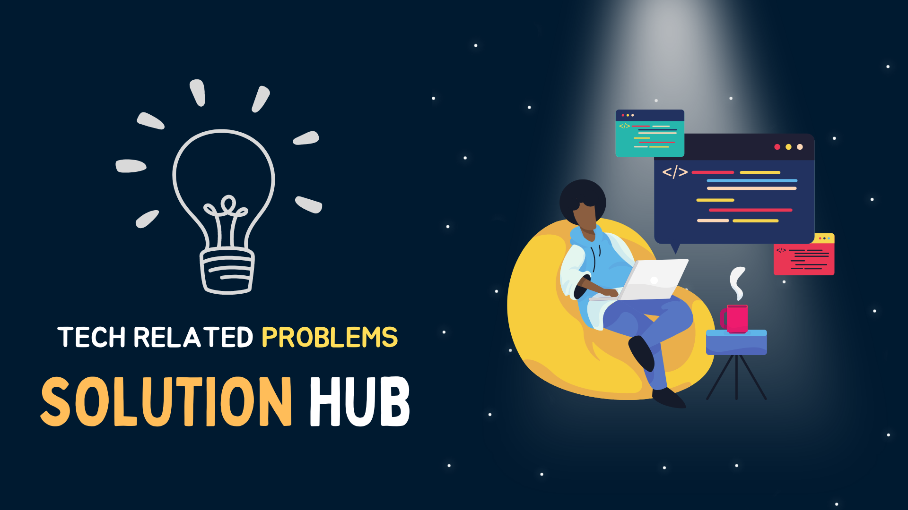

<div align = "center">

## 😊 Tech Related Problems-Solutions Hub😊



</div>

<div align = "center">

### 👩‍💻 Moded App & Software Link 👩‍💻

</div>

#### 🎶 SpotX : Modified Spotify Client **([👉Click Here](https://github.com/amd64fox/SpotX))**

```code
    - Install Spotify
    - Then install this which disable's Spotify Ad
```

<hr>

#### 🗣️ ChatGPT : Desktop Application **([👉GitHub Link](https://github.com/lencx/ChatGPT) ) ([👉Download Link](https://app.nofwl.com/chatgpt/install) )**

```code
    - Download ChatGPT
    - Then install the application
```

<hr>

#### 🗣️ Download Crack Software FREE : HAXPC **([👉 Website Link](https://haxpc.net/) )**

```code
    - Search and Download Your Desire Software
```

<hr>

#### 🗣️ QuilBot Premium FREE : Extension **([👉 Website Link](https://github.com/Raguggg/quillbot-premium-for-free?tab=readme-ov-file#verification-code) )**

```code
    - Download the repository and unpack in extension developer mode
    - Verification Code : ragu@123
```

<hr>

#### 🗣️ Microsoft Activation Scripts : Windows Activator **([👉 Website Link](https://github.com/massgravel/Microsoft-Activation-Scripts) )**

```code
    - Run the following command in CMD
    - irm https://massgrave.dev/get | iex
```

<hr>

#### 🆚 VSCODE Setup Backup (Theme - Extenstions - Profiles) **([👉Download File ](/Enter.code-profile) )**

###### 🔄️ Updated Link **([👉Click Here ](./Vs%20Code%20Backup/Vs%20Version%203.0.code-profile) )**

###### 💖 Basic Vs Code Tutorial Setup **([👉Click Here ](https://youtube.com/playlist?list=PLe30vg_FG4OSNb8JKKCn3eWbY8gPr4_Bl&si=KKLzeW0VAc-u1HF_) )**

- **⬇️ Download The file**
- **➡️ Go to VScode >> Setting >> Profile**
- **👆 Click on Import Profile**
- **🤳 Select The downloaded file**
- **😫 Wait for few seconds and Restart VScode**
- **🥳 Successfully Imported My VSCODE Profile**

<hr>

#### 🎨 Make Windows Terminal Look Better **([👉 Tutorial Link ](https://youtu.be/-G6GbXGo4wo?si=1FN3OLyvs-WDdRhz) )**

- **👆 Window Terminal Themes ([👉Download File ](https://windowsterminalthemes.dev/) )**
- **➡️ Oh My Posh ([👉Download File ](https://ohmyposh.dev/) )**

- **➡️ Nerd Fonts ([👉Download File ](https://github.com/ryanoasis/nerd-fonts/) )**

<hr>

#### 😱 Copy the ON-SCREEN code from any YouTube Video, Image **([👉Tutorial Link](https://youtu.be/mFud2hDrvvQ?si=Rqcj95HWRlC5ToST) ) ( [👉Extension Link](https://chrome.google.com/webstore/detail/blackbox-code-chat-autoco/mcgbeeipkmelnpldkobichboakdfaeon/related) )**

```code
    - Click then extension and Crop your screen
    - Then paste the code in Text Editor
```

<hr>

#### 📷 Fliqlo Desktop Clock ScreenSaver **([👉Download Link](https://fliqlo.com/screensaver/) )**

```code
    - Download fliqlo
    - Then install the application
```

<hr>

#### 📈 Update All Software in Windows using CMD **([👉Tutorial Link](https://www.instagram.com/reel/CyHwRhTyfmQ/?igshid=MzRlODBiNWFlZA%3D%3D) )**

```code
    - Run as CMD as administrator
    - Type : WINGET UPGRADE
    - Type : WINGET UPGRADE --ALL
```

<hr>

#### 🌬️ Create Virtual Windows [Windows Sandbox] ([👉Tutorial Link](https://www.instagram.com/reel/Cw_qb9YyduX/?igshid=MzRlODBiNWFlZA%3D%3D) )

#### 🌌 Extend Your Image Using UnCROP AI ([👉Tutorial Link](https://www.instagram.com/reel/CvExEtmMuqR/?igshid=MzRlODBiNWFlZA%3D%3D) ) ([👉Website](https://clipdrop.co/uncrop) )

<hr>

#### 🫳 Google Feature Website Shortcut

###### Google Docs ( [👉 doc.new](https://doc.new) )

###### Google Sheets ( [👉 sheets.new](https://sheets.new) )

###### Google Slides ( [👉 slides.new](https://slides.new ) )

###### Google Forms ( [👉 forms.new](https://forms.new) )

###### Google Keep ( [👉 keep.new](https://keep.new) )

###### Google Calendar ( [👉 cal.new](https://cal.new) )

###### Google Meeting ( [👉 meet.new](https://meet.new)  )

<hr>

<div align = "center">

### 🪟 Windows Related Issue 🪟

</div>

#### 🧠 Activate Windows 11 (Free) : **([👉Click Here](https://youtu.be/gLpVYYd-8VY) )**

```code
    - slmgr /ipk W269N-WFGWX-YVC9B-4J6C9-T83GX
    - slmgr /skms kms9.MSGuides.com
    - slmgr /ato
```

#### 🧠 Windows 11 Not Updating Properly : **([👉Click Here](https://youtu.be/ho5RY2IwqOEY) )**

```code
    - Mainly Use Windows Update TroubleShooter
```

#### 🥵 Check and Repair SSD : **([👉Click Here](https://www.cdw.com/content/cdw/en/articles/hardware/how-to-check-hard-drive-health.html#:~:text=Windows%20Chkdsk&text=Type%20%22cmd%22%20into%20the%20search,%22chkdsk%22%20and%20hit%20enter.) )**

```code
    - chkdsk
    - chkdsk /scan      // Scan Disk Errors
    - chkdsk /f         // Repair Disk Errors
```

#### 🥵 Windows can't be Installed on drive 0 Partition 1 : **([👉Click Here](https://youtu.be/mBNYPNuIYWo) )**

#### 🥵 Completely Format HDD / SSD **([👉Click Here](https://youtu.be/mBNYPNuIYWo) )**

#### 🫠 Laptop Battery Health Report : **([👉Click Here](https://www.instagram.com/reel/CtMQY1gAUvU/?igshid=MzRlODBiNWFlZA%3D%3D) )**

```code
    - Open CMD (run as administrator)
    - powercfg/batteryreport
    - Go to "C:\Windows\System32\battery-report.html"
```

#### 😴 Laptop Ram Health Check and Repair : **([👉Click Here](https://www.instagram.com/reel/CtMQY1gAUvU/?igshid=MzRlODBiNWFlZA%3D%3D) )**

```code
    - Open CMD (run as administrator)
    - mdsched.exe
```

<hr>

#### 🧠 Run Important Tabs in OneClick in Browser : **([👉Click Here](https://www.facebook.com/reel/1568140050380181) )**

1. **Step - 1 : Create a txt file write the following command**

```code
   @echo off

   start https://www.facebook.com/reel/1568140050380181

   start websitelink
```

#### 🧠 Upgrade Window Powerplan (High Performance Mode) : **([👉Click Here](https://youtu.be/WrJVlIrutow?t=278) )**

```code
    powercfg -duplicatescheme e9a42b02-d5df-448d-aa00-03f14749eb61
```

```code
    powercfg /s SCHEME_MIN
```
#### 🧠 Open Bios in easy way without pressing random Key : **([👉Click Here](https://www.instagram.com/reel/C0frzbDSVRd/?igshid=NzBmMjdhZWRiYQ%3D%3D) )**

- Right Click on Desktop
- Click New -> Shortcut 
- Write the below code :
```code
    shutdown.exe /r /fw /t 1
```
- Save shortcut with Name : "BIOS"
- Open Properties -> Advance -> Run as Adminstrator

#### 🧠 Activate Window 11 Without installing anything : **([👉Click Here](https://www.instagram.com/reel/C0DhP4XrfZv/?igshid=NzBmMjdhZWRiYQ%3D%3D) )**


<hr>

<div align = "center">

### 🍂 Development Problem Solutions 🍂

</div>

#### 🧠 Start Vite React Project (Running Existing Project) : **([👉Click Here](https://www.youtube.com/watch?v=vr-I2HIVmTw))**

```code
    npn create vite@latest
```

```code
    npm install
```

```code
    npm run dev
```

<hr>

#### 🧠 Live server visual studio code not working || Error port 5500 : **([👉Click Here](https://www.youtube.com/watch?v=AbeUIvinBwQ))**

- **Reinstall Live Server**
- **Use LiveServer: Setting : Use Local IP**
- **Live Server > Settings : Port**
  - **Edit in Settings.json**
    - `"liverserver.settings.port" : 0`

<hr>

#### 🧠 How To Run an Existing React App In VSCode : **([👉Click Here](https://youtu.be/WIBSPhffOHI?si=DNfPizYZbPL8Si3g))**

```code
    npm install
```

```code
    npm start
```

<hr>

#### 🧠 Add images and links in Markdown by dragging and dropping in VSCode: **([👉Click Here](https://www.youtube.com/watch?v=jpeh1WorrWM))**

<hr>

#### 🧠 react-scripts' is not recognized as an internal or external command : **([👉Click Here](https://stackoverflow.com/questions/47928735/react-scripts-is-not-recognized-as-an-internal-or-external-command))**

- "react-scripts" is present in package.json, then just type this command

```code
    npm install
```

- If "react-scripts" is not present in package.json, then you probably haven't installed it. To do that, run:

```code
    npm install react-scripts --save
```

<hr>

#### 🧠 Xaamp My SQL is not running: **([👉Click Here](https://stackoverflow.com/questions/18022809/how-can-i-solve-error-mysql-shutdown-unexpectedly))**

- Error Message Shows

```code
   12:19:12 PM [mysql] Attempting to start MySQL app...
   12:19:12 PM [mysql] Status change detected: running
   12:19:13 PM [mysql] Status change detected: stopped
   12:19:13 PM [mysql] Error: MySQL shutdown unexpectedly.
   12:19:13 PM [mysql] This may be due to a blocked port, missing dependencies,
   12:19:13 PM [mysql] improper privileges, a crash, or a shutdown by another method
   12:19:13 PM [mysql] Press the Logs button to view error logs and check
   12:19:13 PM [mysql] the Windows Event Viewer for more clues
   12:19:13 PM [mysql] If you need more help, copy and post this
   12:19:13 PM [mysql] entire log window on the forums
```

- **Solution**

```code
    - Rename folder mysql/data to mysql/data_old
    - Make a copy of mysql/backup folder and name it as mysql/data
    - Copy all your database folders from mysql/data_old into mysql/data (except mysql, performance_schema, and phpmyadmin folders)
    - Copy mysql/data_old/ibdata1 file into mysql/data folder
    - Start MySQL from XAMPP control panel
    - Restart Xaamp
    - Careful with "ibdata1" file, it is very important
```

<hr>

#### 🧠 "#1932- table doesn't exist in engine PhpMyAdmin" **([👉Click Here : Solution](https://youtu.be/B1bukSUIKW0?si=aQI0Jd7Selef_b14))**

<hr>
